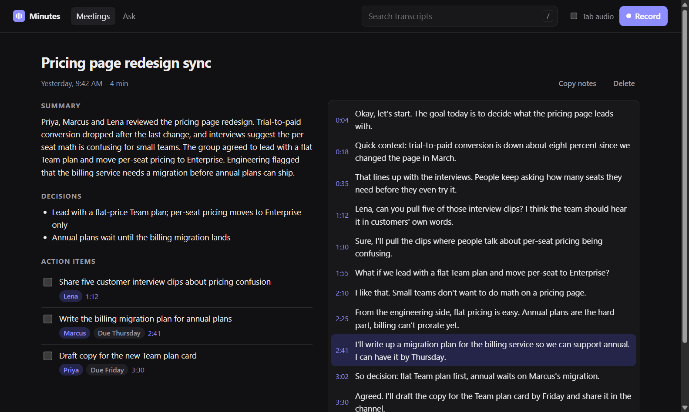
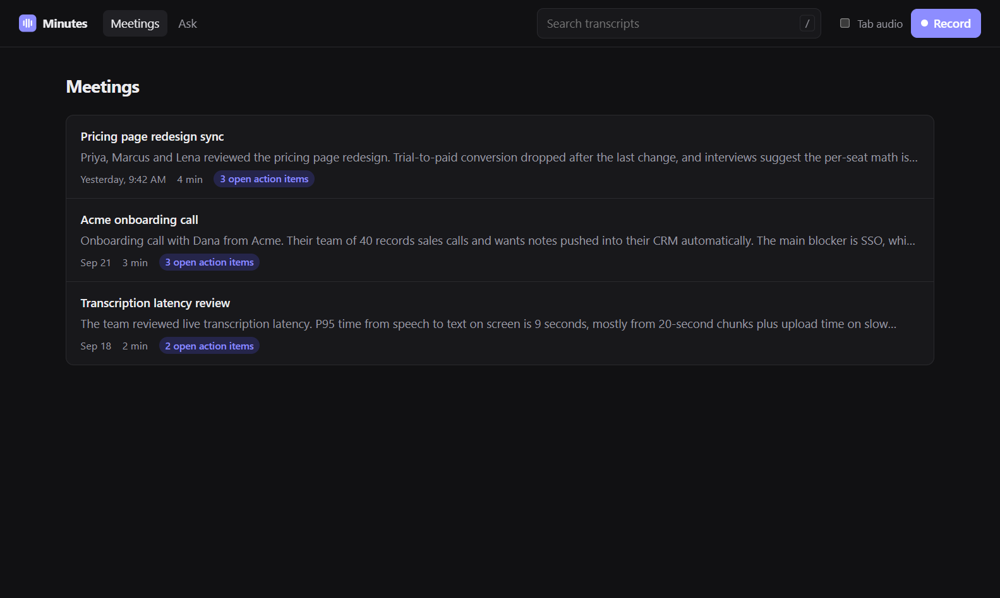
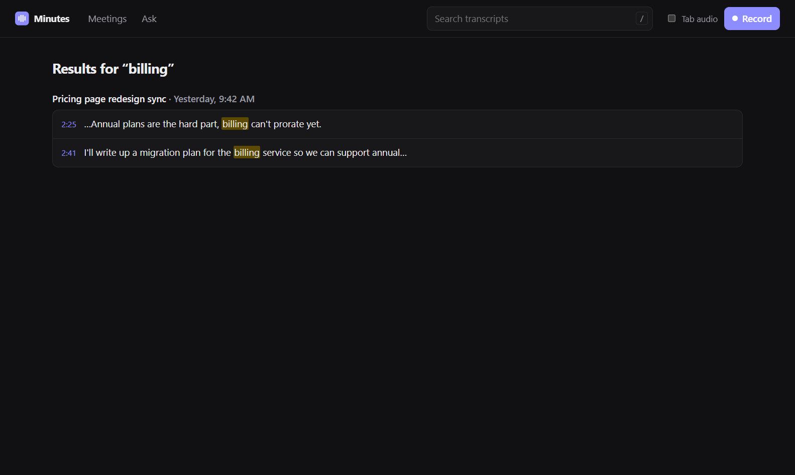
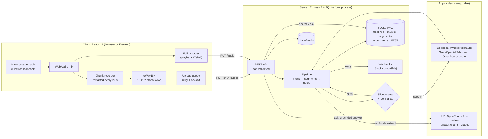

# Minutes

**AI meeting notes you can search and ask questions about.** Record a meeting in the browser or the
desktop app, watch the transcript appear while you talk, and get a summary, decisions, and action
items (with owners, due dates, and a link to the exact moment) when you hit stop. It runs entirely on
free tiers: local Whisper for transcription and OpenRouter's free models for notes.



| Meetings | Search |
|---|---|
|  |  |

## Key highlights

- **Real pipeline, measured.** Five scripted meetings were spoken aloud, recorded and run end to end on free models: **43/43 content checks** passed (transcript, tasks, decisions, grounded answers, silence handling), with **3–8% word error rate** and notes ready **18–50 s after stop**. See [Case studies](#case-studies).
- **Measure, fix, re-measure.** The first real run exposed placeholder owners ("Vendor", "Speaker"), a model looping to 32 duplicate items, and a title of `postmortem.json`. A provider-agnostic cleanup step with a regression test built from that exact output took all three to zero.
- **$0 end to end.** Local Whisper (`whisper-base.en` in Node, ~2.3 s per 20 s chunk on a laptop CPU), OpenRouter free models with fallback chains, and a [$0 deployment design](docs/DEPLOYMENT.md) (Oracle Always Free + Cloudflare Tunnel/Access + Litestream→R2).
- **Built for bad networks and flaky AI.** Idempotent chunk uploads, client-side retry queue, restart recovery, silence gate before any model call, retries only for transient errors (a 402 fails fast), and *Try again* on any failed meeting.
- **Desktop + web from one codebase.** React 19 in the browser, the same app inside Electron with system-audio loopback, so it captures the other side of a Zoom call.
- **Tested like a product.** 16 server tests, 17 end-to-end tests (11 user flows in the [Obscura](https://github.com/h4ckf0r0day/obscura) headless browser, 6 recording/interaction tests in Chromium with a fake mic), plus a Docker smoke test in CI.

## Quick start

```bash
npm install
cp .env.example .env        # paste a free OPENROUTER_API_KEY (https://openrouter.ai/keys), and that's it
npm run seed                # optional: 3 demo meetings, works without API keys
npm run dev                 # API on :3001, web app on http://localhost:5173
```

No key yet? `AI_PROVIDER=mock npm run dev` runs the whole app offline with a deterministic fake AI.
The first real recording downloads the Whisper model (~80 MB, cached afterwards).

Desktop app (captures system audio on Windows):

```bash
npm run build && npm start  # server also serves the built web app on :3001
npm run desktop             # in a second terminal
```

## High-level design

Minutes is one Node process with one SQLite file. Clients stream audio in 20-second chunks while the
meeting runs. The server transcribes each chunk as it arrives, so when the user presses stop only the
last chunk and one notes call remain. That's why notes land seconds after the meeting instead of minutes.

| Concern | Design choice |
|---|---|
| Latency | Transcribe during the meeting (per chunk), not after it |
| Reliability | Chunks are durable on disk before the `202`; every step is idempotent and resumable after a crash |
| Cost | Silence never reaches a model; local STT; free LLMs with fallback; chunk files deleted once transcribed |
| Provider churn | `Stt` / `Llm` interfaces; OpenRouter, Anthropic, Whisper-compatible, local and mock implementations chosen by env var |
| Search & Q&A | FTS5/BM25 over transcript segments; answers are generated only from retrieved excerpts, with citations |
| Security | No login in the app itself; it sits behind Cloudflare Access with no open ports (see [deployment](docs/DEPLOYMENT.md)) |

### System diagram



## Low-level design

### Meeting lifecycle (the pipeline)

```
recording ──PUT chunk──► chunk: pending ─transcribe (≤3 tries)─► done   (chunk file deleted)
    │                                                      └──► failed (kept for retry)
    └─finish──► processing ──all chunks settled──► extract notes ──► ready ──► webhooks
                                                          └─ error ─► failed ──reprocess──► processing
```

- **`transcribeChunk`** reads the chunk file, calls `ai.transcribe`, and replaces that chunk's segments inside one transaction (so a retry never duplicates lines). Timestamps are shifted by the chunk's `start_ms`. Errors marked `retryable: false` (bad key, 402 no credit) skip the backoff.
- **`maybeFinalize`** runs after every chunk settles and on `finish`. It proceeds only when no chunk is `pending`, guarded by an in-process set so concurrent chunks can't extract twice. A meeting with no speech is marked ready with *No speech detected* and never calls the LLM.
- **`cleanExtraction`** post-processes every model's output: placeholder owners/dues → `null`, duplicate decisions/items removed (case- and punctuation-insensitive), at most 25 items, file extensions stripped from titles. It exists because of [case study run 1](#case-studies).
- **`recover`** re-queues pending chunks and unfinished meetings on boot, so a crash mid-meeting loses nothing.

### Data model (SQLite)

| Table | Holds | Notes |
|---|---|---|
| `meetings` | title, status, summary, decisions (JSON), duration, error, `title_locked` | a user-edited title is never overwritten by the model |
| `chunks` | `(meeting_id, seq)`, `start_ms`, mime, status, error | primary key makes uploads idempotent |
| `segments` | `(meeting_id, seq)`, `start_ms`, `end_ms`, text | one row per transcript line |
| `segments_fts` | FTS5 index over `segments.text` | kept in sync by insert/update/delete triggers |
| `action_items` | text, owner, due, `start_ms`, done | `start_ms` powers "jump to the moment" |

### API

| Route | Purpose |
|---|---|
| `POST /api/meetings` · `GET /api/meetings` · `GET/PATCH/DELETE /api/meetings/:id` | CRUD; `PATCH` title locks it |
| `PUT /api/meetings/:id/chunks/:seq` | upload one chunk (idempotent, 25 MB cap) → `202`, transcribed in the background |
| `PUT/GET /api/meetings/:id/audio` | full recording for playback (HTTP range requests supported) |
| `POST /api/meetings/:id/finish` · `/reprocess` | stop recording; retry failed chunks and regenerate notes |
| `PATCH /api/action-items/:id` | mark done |
| `GET /api/search?q=` | FTS5 search, BM25-ranked, highlighted snippets with timestamps |
| `POST /api/ask` | retrieve top excerpts → LLM answer citing `[n]` → sources returned for click-through |

### Recorder (client)

- **Why restart `MediaRecorder` every 20 s?** Timeslices after the first have no container header and can't be decoded alone. A fresh recorder per chunk gives standalone files, and the next one starts *before* the previous stops, so no audio falls between chunks.
- Each chunk is decoded and resampled to **16 kHz mono 16-bit WAV** in the browser (`OfflineAudioContext`). Every STT backend accepts it, the server needs no ffmpeg, and the server can measure loudness for the silence gate.
- The upload queue retries with backoff; `stop` waits for pending conversions and uploads before calling `finish`.

### AI layer

- `createAi(env)` picks an `Llm` (`openrouter` | `anthropic` | `mock`) and an `Stt` (`local` | `whisper` | `openrouter` | `mock`), wraps STT in the silence gate, and reports what it chose at startup.
- **Notes**: JSON-schema structured output generated from the zod schema (`z.toJSONSchema`), validated with zod, one repair round that shows the model its own invalid output. Only 408/429/5xx are retried.
- **Ask**: FTS5 retrieval → numbered excerpts → the model must cite `[n]` for every claim or say the answer isn't there.

## Tech stack: what, for what, and why

| Tech | Used for | Why this one |
|---|---|---|
| **TypeScript** (Node 22, `tsx`) | everything | One language across server, web and desktop; `tsx` runs `.ts` directly, so there's no build step for the server |
| **npm workspaces** | monorepo (`apps/server`, `apps/web`, `apps/desktop`) | Built in, no extra tooling (Turborepo/Nx would be overkill for three packages) |
| **Express 5** | REST API | Async error handling is native in v5; small, well known, and enough for ~15 routes |
| **better-sqlite3 + FTS5** | storage + full-text search | One file, zero ops, BM25 ranking and snippets built in. `node:sqlite` lacks FTS5. Synchronous API makes transactions trivial. Schema maps to Postgres `tsvector` later |
| **zod 4** | request validation, LLM output schema | One schema serves as the runtime validator *and* the JSON Schema sent to the model |
| **React 19 + Vite** | web UI | Fast dev server, tiny config; the same bundle is loaded by Electron |
| **Electron** | desktop app | The only way to capture **system audio** (the remote side of a call) without a virtual audio driver: `setDisplayMediaRequestHandler` with loopback |
| **Web Audio / MediaRecorder** | capture, mixing, WAV conversion | Native browser APIs, so there are no audio dependencies on either side |
| **@huggingface/transformers** (`whisper-base.en`, q8 ONNX) | default transcription | Free, private (audio never leaves the machine), no account; fast enough for real time on a CPU |
| **@openrouter/sdk** | notes + Ask (and optional audio STT) | Official SDK with typed params, built-in retries/backoff for 429/5xx, and model fallback lists, which is essential for free models that rotate or get rate-limited |
| **@anthropic-ai/sdk** | optional Claude provider | Best-quality notes when a paid key is available; one env var switch |
| **OpenAI-compatible Whisper** | optional STT (Groq, OpenAI, faster-whisper) | Groq's free tier gives 8 h of audio a day with real segment timestamps |
| **node:test + tsx** | 16 server tests | Built into Node; no Jest/Vitest config. Tests use real HTTP + SQLite with injected fake AI |
| **Playwright + Obscura** | 17 end-to-end tests | Obscura is a lightweight Rust headless browser over CDP, used for user-behavior flows; Chromium covers what Obscura can't yet (fake mic, `getUserMedia`). Gaps documented in [`e2e/README.md`](e2e/README.md) |
| **Windows SAPI TTS** | case-study audio | Generates reproducible multi-voice meetings with a known script, so transcripts can be scored by WER |
| **Docker + GitHub Actions + GHCR** | CI/CD | Free for public repos; multi-arch image (amd64 + arm64 for Oracle's Ampere VM) |
| **Cloudflare Tunnel/Access, Litestream→R2, Oracle Always Free** | $0 production | No open ports, login at the edge, continuous SQLite backup; details in [`docs/DEPLOYMENT.md`](docs/DEPLOYMENT.md) |

## Case studies

Five meetings, each written to stress one thing, were synthesized to speech with two Windows voices
standing in for six people. They were cut into 20 s WAV chunks and sent through the **same HTTP API the
browser uses**, with local Whisper for transcription and OpenRouter free models for notes. Nothing is
mocked. Every output is scored automatically against the script. The full report, with transcripts,
notes and cited answers, is in [`docs/case-studies.md`](docs/case-studies.md), with raw data in
[`docs/case-studies/results.json`](docs/case-studies/results.json).

| # | Case | What it tests | WER | Notes ready after stop | Notes model (free) |
|---|---|---|---|---|---|
| 1 | Sprint planning | owners by name, a decision with a reason, a risk | 7.1% | 50 s | `nvidia/nemotron-3-super-120b-a12b:free` |
| 2 | Customer discovery call | external party, conditional commitment, Q&A | 3.0% | 27 s | `nex-agi/nex-n2.5-mini:free` |
| 3 | Incident postmortem | numbers, root cause, 4 follow-ups, multi-question Ask | 7.0% | 26 s | `dots-studio/dots-3-note-preview:free` |
| 4 | Hiring debrief | **no decision was made**: the notes must not invent one | 3.4% | 41 s | `dots-studio/dots-3-note-preview:free` |
| 5 | Late start | 25 s of silence before anyone speaks | 8.3% | 18 s | `dots-studio/dots-3-note-preview:free` |

### Run 1 → run 2: what the first real run found and what fixed it

| Finding in run 1 | Cause | Fix | Run 2 |
|---|---|---|---|
| Owners written as "Vendor", "Speaker", "Unspecified (likely…)", `""` in 3 of 5 meetings | Free models fill a nullable field instead of leaving it null | Prompt: never use placeholders; `cleanExtraction` maps them to `null` | **0 placeholders** |
| Customer call returned **32 action items** (the same 4, looped 8×) | A free model (`poolside/laguna-s-2.1:free`) looped | Dedupe (case/punctuation-insensitive) + 25-item cap | **0 duplicates**, max 6 items |
| Postmortem titled `postmortem.json` | Model echoed a filename | Strip file extensions from titles | "Postmortem for Tuesday's Outage" |
| "dark mode" decision scored as missed | **Checker bug**: model wrote `Dark‑mode` with U+2011 | Normalize dashes in the scorer | scored correctly |
| One score mixed "task found" with "owner right" | Checker design | Separate *task captured* and *owner attributed* checks | clearer signal |

**Run 2 result: 43/43 content checks passed. Owners: 3/12.** Every owner named in the conversation
("Jordan, can you own the fix?") was captured. All 9 misses are first-person commitments ("I will
update the roadmap"). The transcript has no speaker labels, so no model can know who "I" is, and the
pipeline correctly records `null` instead of guessing (run 1 guessed "Speaker"). **Speaker diarization is the fix, and it's next on the roadmap.**

Other observations:
- **Grounded Ask held up in both runs.** Every question was answered correctly with `[n]` citations to the right transcript lines. The hiring debrief notes correctly record *no decision*.
- **Silence costs nothing.** The late-start meeting's silent chunk was dropped by the -50 dBFS gate before reaching Whisper, and the first transcript line lands at 0:20.
- **Free-model variance is real.** OpenRouter served three different models across five meetings, and one title ("analysis") was weak. The fallback chain keeps it working; the cleanup step keeps it safe; a paid model (`AI_PROVIDER=anthropic`) is one env var away when quality matters more than cost.
- Run 1's report is kept for comparison: [`docs/case-studies/run-1-before-fixes.md`](docs/case-studies/run-1-before-fixes.md).

Reproduce: `npm run case-studies` (Windows, for SAPI voices; ~13 OpenRouter requests).

## AI providers and free models

| Job | Default | Free models / options |
|---|---|---|
| Transcription | **local Whisper** (`STT_PROVIDER=local`) | `whisper-base.en` in-process. Or Groq's free Whisper (`STT_PROVIDER=whisper`, 8 h audio/day). OpenRouter audio models (`thinkingmachines/inkling-small:free`, `thinkingmachines/inkling:free`, `nvidia/nemotron-3-nano-omni-30b-a3b-reasoning:free`) work with `STT_PROVIDER=openrouter` but **OpenRouter returns 402 for audio unless the account holds ≥ $0.50**, even on `:free` models |
| Notes + Ask | **OpenRouter** (`OPENROUTER_API_KEY`) | `nvidia/nemotron-3-super-120b-a12b:free` → `qwen/qwen3.8-27b:free` → `openrouter/free` (auto-routes to any free model) |

Free models allow 20 requests/min and 50/day (1,000/day after a one-time $10 credit); a meeting
uses one notes call and one call per question. The lineup changes weekly: **`npm run models:free`**
lists what's free right now and which models support audio and JSON schema; override with
`OPENROUTER_MODELS` / `OPENROUTER_STT_MODELS`. Claude is `AI_PROVIDER=anthropic`. See [`.env.example`](.env.example).

## Testing

| command | what |
|---|---|
| `npm test` | 16 server tests: real HTTP + SQLite with a fake AI, the OpenRouter adapter against a fake SDK client (request shape, repair round, 402 fail-fast), local-Whisper input validation, WAV parsing, silence gate, provider selection, and `cleanExtraction` on run 1's real output |
| `npm run e2e` | 17 end-to-end tests: 11 user-behavior flows in **[Obscura](https://github.com/h4ckf0r0day/obscura)** (browse notes, search → jump to the moment, ask → follow a citation, rename, delete confirm, resume an interrupted recording, failed notes → Try again, HTML-injection safety…), plus 6 recording/interaction tests in Chromium with a fake mic. See [`e2e/README.md`](e2e/README.md) |
| `npm run case-studies` | the 5 real-audio case studies above |
| `npm run typecheck` / `npm run build` | server + web |

CI runs typecheck, unit tests, build, both e2e suites and a Docker smoke test on every PR.

## Deploying for $0

Oracle Cloud Always Free VM + Cloudflare Tunnel/Access + Litestream→R2 backups + local or Groq Whisper
+ OpenRouter free models, shipped by GitHub Actions as a multi-arch image. The full design (capacity math,
security model, RPO/RTO, runbook, scaling path) is in [`docs/DEPLOYMENT.md`](docs/DEPLOYMENT.md), and the
Compose stack is in [`deploy/`](deploy/).

**GitOps option, one platform:** k3s + Argo CD on the same Oracle VM, with Oracle Object Storage for backups
and Traefik + Let's Encrypt for HTTPS. Merging to `main` deploys. See [`docs/DEPLOY-ARGOCD.md`](docs/DEPLOY-ARGOCD.md).

## Project layout

```
apps/server     Express + better-sqlite3 API, processing pipeline, tests
  src/providers   OpenRouter · local Whisper · Anthropic · Whisper-compatible STT · mock
  case-studies    5 scripted meetings → speech → real pipeline → docs/case-studies.md
apps/web        React 19 + Vite app (recorder, meeting, search, ask)
apps/desktop    Electron shell for system-audio capture
e2e             Playwright suites: Obscura (user behavior) + Chromium (recording)
deploy          docker-compose: app + Cloudflare Tunnel + Litestream + audio backup
docs            PLAN.md (implementation plan) · DEPLOYMENT.md ($0 system design) · case studies
```

## Conclusion

Minutes covers the core loop of an AI meeting-notes product: capture (including system audio on
desktop), streaming transcription, structured notes, search and grounded Q&A, and automations. It is
built to survive bad networks, crashes and unreliable free models. The case studies show where it
stands honestly. Transcription and content extraction are solid on free models (43/43, 3–8% WER).
The remaining gap, owners of first-person commitments, is a missing input (who is speaking), not a
prompting problem. The measure → fix → re-measure loop that took run 1's placeholder and looping
output to zero is how the next improvements will be made too.

## Roadmap

Speaker diarization (owners for "I will…") → a larger hand-labeled extraction eval set →
hybrid search with embeddings → a React Native companion app on the same chunk API → Postgres + app-level auth.
Details in [`docs/PLAN.md`](docs/PLAN.md#9-roadmap-in-priority-order).
